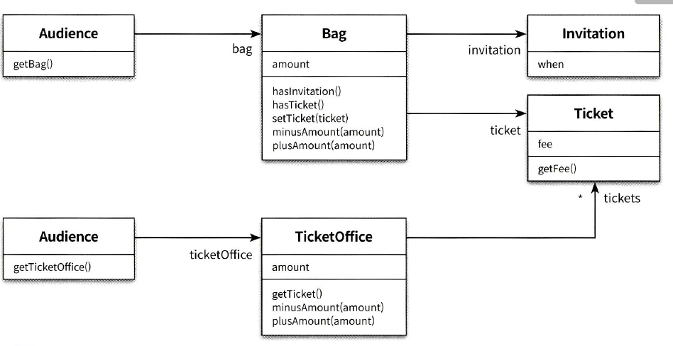
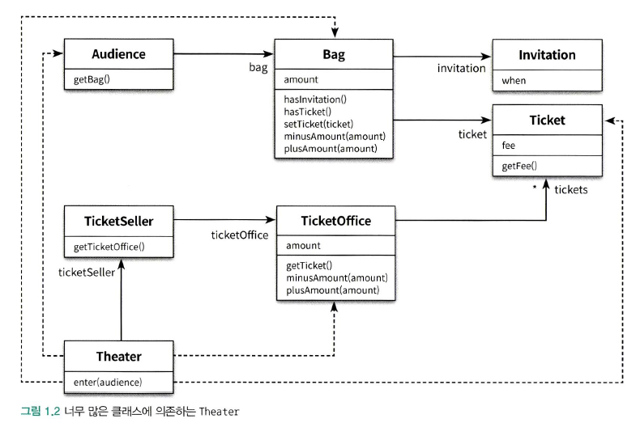

> 들어가며

패러다임은 동일한 규칙과 방법을 공유하여 불필요한 부분에 대한 의견 충돌을 방지하기 때문에 중요하다.

> 01. 객체, 설계

이 책에서는 객체지향 패러다임을 설명하기 위해 추상적인 개념이나 이론만 앞세우는 것이 아닌 개발자인 우리가 가장 잘 이해할 수 있고 능숙하게 다룰 수 있는 코드를 이용해 객체 지향의 다양한 측면을 설명하려고 노력할 것이다.

티켓 판매 애플리케이션



예제 코드에 맞게 작성했을 때 몇 가지 문제점을 안고 있다.

02. 무엇이 문제인가

로버튼 마틴은 <클린 소프트웨어>에서 소프트웨어 모듈이 가져야하는 세 가지 기능에 관해 설명한다.

> 첫 번째 목적: 실행중에 제대로 동작한다.
> 두 번째 목적: 변경을 위해 존재한다.
> 세 번째 목적: 코드를 읽는 사람과 의사소통한다.

마틴에 따르면 모든 모듈은 제대로 실행돼야 하고, 변경이 용이해야 하며, 이해하기 쉬워야 한다고 한다.<br/>
그러나, 티켓 판매 애플리케이션은 정상적으로 동작은 하지만, 변경 용이성과 읽는 사람과의 의사소통이라는 목적은 만족시키지 못한다.

```java
public class Theater {
    private TicketSeller ticketSeller;

    public Theater(TicketSeller ticketSeller) {
        this.ticketSeller = ticketSeller;
    }
    
    public void enter(Audience audience) {
        if(audience.getBag().isInvited()) { // 초대장을 받았을 경우 금액 차감 없이 티켓 획득
            Ticket ticket = ticketSeller.getTicketOffice().getTicket();
            audience.getBag().addTicket(ticket);
        } else {                            // 초대장을 받지 않았을 경우 금액 차감 후 티켓 획득
            Ticket ticket = ticketSeller.getTicketOffice().getTicket();
            
            audience.getBag().minusAmount(ticket.getFee());
            ticketSeller.getTicketOffice().plusAmount(ticket.getFee());
            
            audience.getBag().addTicket(ticket);
        }
    }
}
```

뿐만 아니라 예상과 다르게 동작할 가능성이 있는 코드이다.

만약, 권한이 없는 사람이 관람객의 가방을 열어서 돈을 가져간다면?<br/>
만약, 권한이 없는 사람이 소극장 매표소에 보관 중인 티켓을 가져간다면?<br/>

또한, 코드를 이해하기 어렵게 만드는 또 다른 이유는 세부적인 내용을 한꺼번에 기억해야 한다는 것이다.

Theater#enter 메서드를 이햏라기 위해서는 관람객(Audience)가 가방(Bag)을 가지고 있고, 가방 안에 현금과 티켓이 들어 있으며 매표소 판매원(TicketSeller)이 매표소(TicketOffice)에서 티켓을 판매하고, 매표소안에 돈과 티켓이 보관되어 있다는 사실을 전부 알고있어야 한다.

하지만 더 큰 문제는 변경에 취약한 코드라는 것이다.

이 코드는 관람객이 현금과 초대장을 보관하기 위해 항상 가방을 가진다는 전제로 한다.<br/>
또한, 판매원이 매표소에서만 티켓을 판매한다는 가정도 있다.

그런데 만약, 관람객이 가방을 들고 있지 않다면?<br/>
그런데 만약, 현금이 아닌 신용카드를 사용한다면?<br/>
그런데 만약, 매표소 밖에서 티켓을 판매해야 한다면?

이것은 객체 사이의 의존성(dependency)과 관련된 문제다.<br/>
의존성은 변경에 대한 영향을 암시한다. 의존성이라는 말 속에는 어떤 객체가 변경될 때 그 객체에게 의존하는 다른 객체도 함께 변경될 수 있다는 사실이 내포돼 있다.




객체 지향 설계는 서로 의존하면서 협력하는 객체들의 공동체를 구축하는 것이다.<br/>
따라서, 우리의 목표는 애플리케이션의 기능을 구현하는데 필요한 최소한의 의존성만 유지하고 불필요한 의존성을 제거하는 것이다.

설계의 목표는 객체 사이의 결합도를 낮춰 변경이 용이한 설계로 만들어야 한다.
